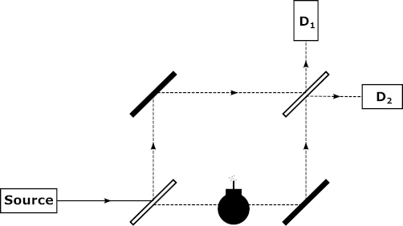

Topic H: Defining and Measuring Time

Tutor: Dr. Ian Lindsay

While we generally perceive time in terms of astronomical events (the rotation of the Earth in a day or its orbit of the Sun in a year), since 1967 the SI definition of the second has been quantum mechanical, based on the frequency of radiation corresponding to the transition between two hyperfine levels of Caesium. The Cs atomic clock remains, to this day, the international standard by which the second is defined. This is unlikely to remain the case: Recent rapid advances in the physics of frequency standards and metrology, particularly in precision laser spectroscopy and the cooling and trapping of ions and atoms were recognised by the Nobel prizes for Physics in 2005 and 2012, respectively [^1][^2][^3]. While these developments have already resulted in optical clocks that significantly outperform the current Cs standard, its replacement still faces a number challenges and has yet to be agreed [^4]. Simultaneously, the next generation of clocks based on nuclear transitions are being considered [^5]. This project will provide the opportunity to investigate and understand the range of science and technologies comprising the current state of the art in frequency and time standards and measurement. Sub areas of focus may include laser-based measurement techniques [^2], atomic frequency standards [^1], practical exploitation [^6], applications to fundamental science [^7] and future developments.

Can the bomb be detected without touching it with a single photon?

Further reading:

[^1]: S. A. Diddams, Science 306, 1318 (2004).

[^2]: T. W. Hänsch, ChemPhysChem 7, 1170 (2006).

[^3]: N. Poli et al., Riv. Nuovo Cimento 36, 555 (2013).

[^4]: P. Gill, in 8th Symp. Freq. Stand. Metrol. 2015, edited by F. Riehle (Iop Publishing Ltd, Bristol, 2016), p. 012053.

[^5]: L. von der Wense and B. Seiferle, Eur. Phys. J. A 56, 277 (2020).

[^6]: M. Delehaye and C. Lacroute, J. Mod. Opt. 65, 622 (2018). \[7\] C. Orzel, Phys. Scr. 86, 068101 (2012).